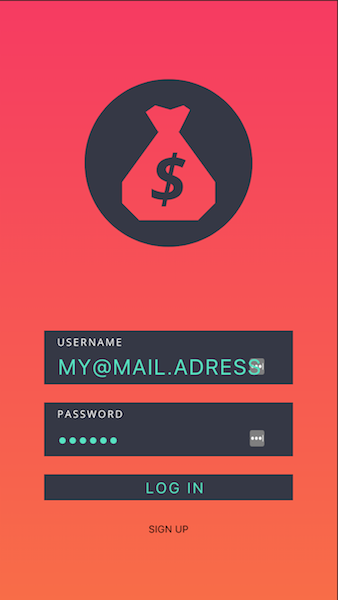
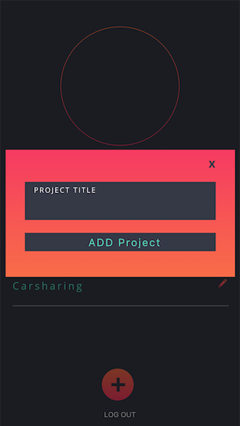

# Share it easy

A Student-Prorejct realised with Vue.js (https://github.com/vuejs/vue) and Firebase (https://firebase.google.com/).

The Web-App provides basic functionality to split expenses with Friends.

The App is still work in progress and is currently only optimised for mobile devices.


Features:
- Add User / Sign In
- Create / Delete Projects 
- Edit Projects
- Add Users to Project
- Add / Remove Expenses
- Edit Expenses


Missing Features:
- Cash up function
- Data-Visualizations
- Desktop Version

Inspirations:
- Flatastic (http://flatastic-app.com/)
- Splitwise (https://www.splitwise.com/)

Impressions of the App can be found in the Screenshots-Folder</br>
 

valentin.berger@stud.hslu.ch

## Build Setup

``` bash
# install dependencies
npm install

# serve with hot reload at localhost:8080
npm run dev

# build for production with minification
npm run build

NOTE: If you want to test this App you need to fill in the firebase.js file with your Firebase informations
